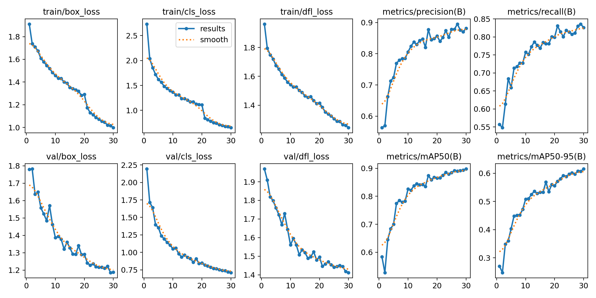

# Face Mask Detection using YOLO v8

## Overview
This project utilizes YOLO v8 for detecting face masks in both images and videos. The model has been trained on a dataset of approximately 6000 images, enabling it to identify faces and determine whether masks are worn or not. The detector provides two main measures:
- the number of individuals wearing masks and the number of individuals not wearing masks in the image. 
- For videos, it calculates the number of scenes where masks are worn and provides a total count of such instances recorded.

## Usage
### Detecting Masks in Images or Videos
One can either run the python or the jupyter notebooks in their enviroment or else Dodcker file and compose files are also provided to run in an isolated enviroment.

### Local Enviroment

Navigate to the **mask_detection** repository where the following files can be accessed and run the  file:

- **detection.py**  is terminal-based interactive script which will prompt for inputs to detect masks in either an image or video.

- **Detection.ipynb** and **yolo.ipynb** are interactive notebooks to playaround with the code.

### Docker Conatainer

One can also use docker container to run the files in an isolated environment. In the classification folder Dockerfile and compose file are provided. One can run the following commands to build the docker image and container as well.

#### Building Image
Here the working directory should be the mask_detection repository.
Default tagname - facedetection

`docker buid -t tagname .`  

#### Creating Container

Working directory - `\\wsl.localhost\Ubuntu`

``` 
docker run -it -p 8888:8888 -v /run/desktop/mnt/host/wslg/.X11-unix:/tmp/.X11-unix 
-v /run/desktop/mnt/host/wslg:/mnt/wslg  
-e DISPLAY=:0 
-e WAYLAND_DISPLAY=wayland-0 
-e XDG_RUNTIME_DIR=/mnt/wslg/runtime-dir  tagname # default - facedetection

```
To mount the drive onto the notebook add the following line in the above code:

`-v directory_to_add:/facemask`

#### compose
compose file can also be used by using the following code to build and manage multiple services in Docker containers. 
` docker compose up`

To mount the drive directory should me maped in volumes, similar to terminal command.

`-v directory_to_add:/facemask`

Note: The default password for the jupyter is **facedetection**


## Repository Structure
### mask_detection
The **mask_detection** folder contains scripts and files related to the face mask detection system:

- **detection.py:** A terminal-based interactive script for detecting masks in images or videos.
- **sort.py**: Script for object tracking.
- **detectiontion.ipynb**: IPython Notebook for easier understanding of the code structure and functionality.
- **requirements.txt**: File listing libraries required for the scripts to work.
- **2_class(default)**: YOLO v8 model weights for detecting face with mask and face without mask.
- **best_7**: YOLO v8 model weights optimized for detecting weights only for detecting faces with mask on.
- **Dockerfile**: build image and to run script in container
- **compose**: build and manage multiple services in Docker containers.

- **yolo.ipynb**: contains code for the preporcessing and the training process. The annotations were modiefied according to the desired ouput and changed to yolo fromat. Also all images were resized to 640 by 640 before training 
- **data.yaml:** config file for yolo to be trained
- **yolov8n.pt:** pretrained weight for yolo 

### Output 
Contains results for the 3 videos to test the model


## Dataset
The Dataset used to train the model contains 6000 images for different scenarios which are expalined by 20 labels i.e. 'face_with_mask', 'mask_colorful', 'face_no_mask',
'face_with_mask_incorrect', 'mask_surgical', 'face_other_covering', 'scarf_bandana', 'eyeglasses', 'helmet', 'face_shield', 'sunglasses', 'hood', 'hat', 'goggles', 'hair_net', 'hijab_niqab', 'other', 'gas_mask', 'balaclava_ski_mask', 'turban'. But the model is trained only for 2 classes **'face with mask'** and **'face without mask'**. This is done by combining the above mentioned classes into suitable new class.

## Model
The YOLO v8n model architecture was used for this project. The model was trained on 3461 images approximately  and 900 for validation for 30 epochs with batch size of 16. Rest of the images are used as test samples.  

## Results
The model achieved mAP50 of 0.89 and mAP50-95 of 0.61 for the two classes on the validation set. 





